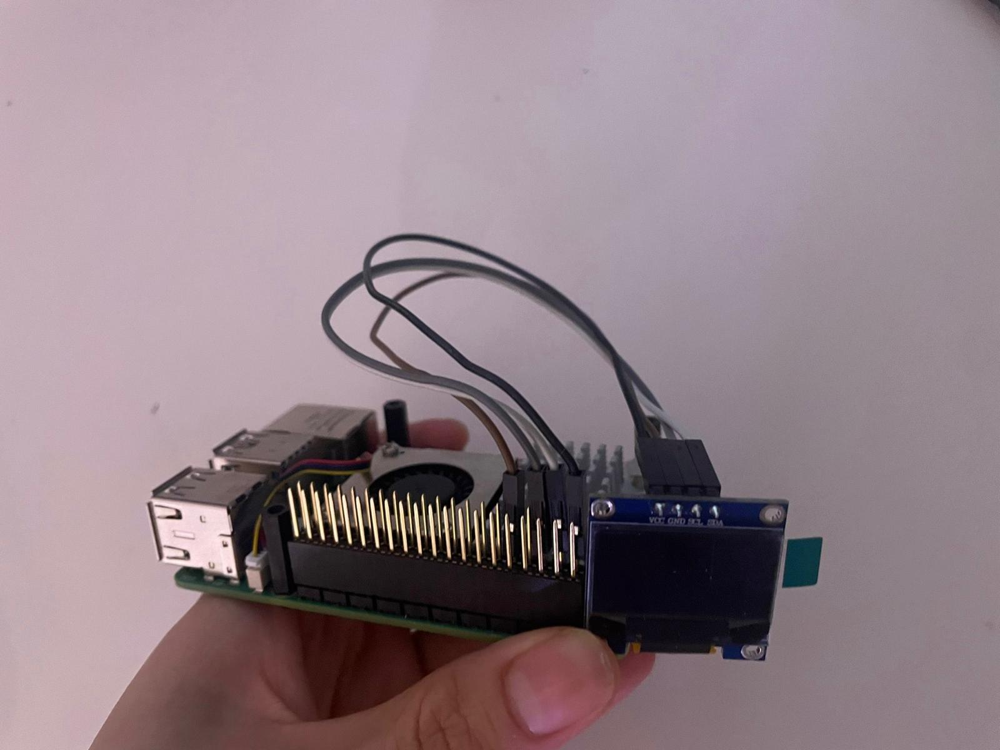
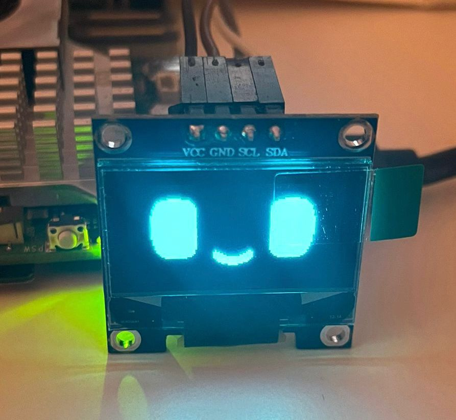
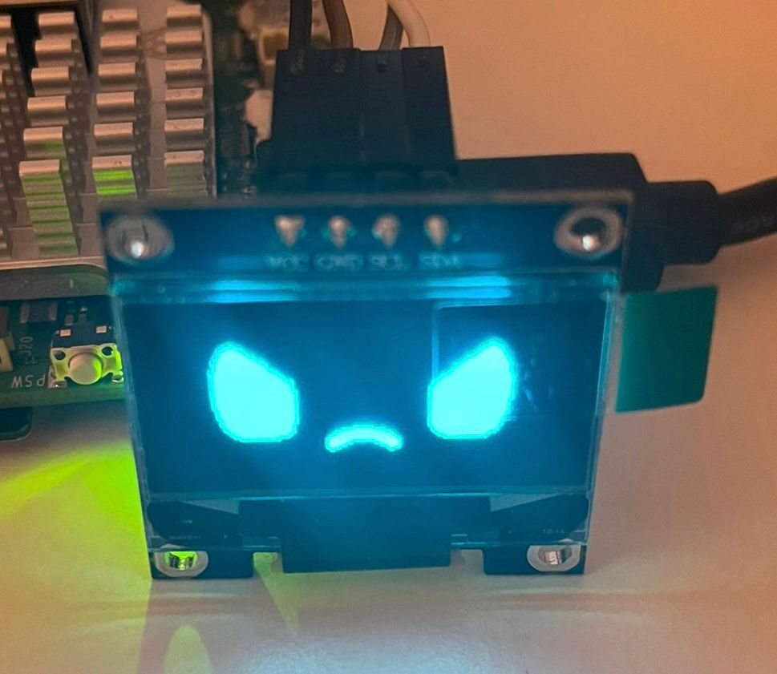

# Emotion Face Display 🎭

Display animated emotion faces on an OLED screen (SSD1306). Automatically cycles through 13+ emotions with smooth animations. Designed for Raspberry Pi 5.

**Features:** Auto-loop emotions • Easy to add new emotions • Frame-by-frame animations • Dynamic loading from PNG files 


## Installation Steps

### 1. Connect the OLED display

Connect the display pins as shown:
- GND → Ground  
- VCC → 3.3V  
- SCL → GPIO3 (Pin 5)  
- SDA → GPIO2 (Pin 3)



### 2. Setup Raspberry Pi

Update system and install dependencies:
```bash
sudo apt-get update && sudo apt-get -y upgrade
sudo apt-get install python3-pip python3-venv git
sudo reboot
```

### 3. Verify I2C connection

Verify I2C is working (look for address `3c`):
```bash
sudo i2cdetect -y 1
```

If I2C is not enabled, run `sudo raspi-config` → Interfacing Options → I2C → Enable

### 4. Install the project

Clone repository:
```bash
git clone https://github.com/theaipetcompany/emotion
cd emotion
```

Create virtual environment (If not already created):
```bash
python3 -m venv venv --system-site-packages
source venv/bin/activate
```

Install Adafruit Blinka (confirm "Y" to reboot when prompted):
```bash
pip3 install --upgrade adafruit-python-shell
wget https://raw.githubusercontent.com/adafruit/Raspberry-Pi-Installer-Scripts/master/raspi-blinka.py
sudo -E env PATH=$PATH python3 raspi-blinka.py
```

Activate venv and install dependencies:
```bash
source venv/bin/activate
pip3 install --upgrade pip setuptools wheel
pip install -r emotion/requirements.txt
```

### 5. Run the application

```bash
cd emotion
python3 main.py
```

The app will auto-loop through all 13 emotions continuously. Press `Ctrl+C` to stop.

## ➕ Adding New Emotions

1. Create a folder in `emotion/emotions/` with your emotion name
2. Add PNG frames named sequentially: `frame0.png`, `frame1.png`, etc.
3. Run the app - your emotion will be automatically loaded!

**Note:** Images are auto-resized to 128x64 and converted to black/white

## 🔧 Troubleshooting

**Missing lgpio:** `pip install lgpio`  
**Missing pkg_resources:** `pip install setuptools`  
**Display not working:** Verify I2C with `sudo i2cdetect -y 1` (look for `3c`)  
**OLED must be SSD1306** (SH1106 not compatible)

## 📸 Screenshots




---

**Resources:** [Adafruit Blinka](https://github.com/adafruit/Adafruit_Blinka) • [CircuitPython SSD1306](https://github.com/adafruit/Adafruit_CircuitPython_SSD1306)  